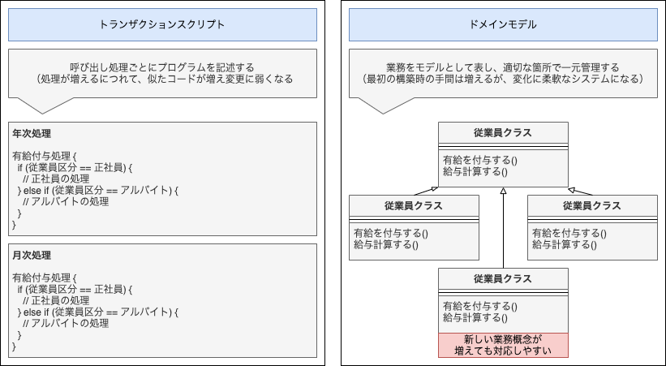

# ドメイン駆動設計

## 【WHAT】 ドメイン駆動設計の概要

**ドメイン駆動設計**とは「顧客と開発者が共通言語で会話して、一体感あるチームとして、事業価値の高いソフトウェアを開発する手法」である。

## 【WHO】 DDDを始められる人とは

DDDは誰でも取り組むことができる。 
ソフトウェア開発の現場にはさまざまな不満が存在しているが、現状を変えたいと言う情熱である人であれば誰でもDDDを始めることができる。

##### ▼ ドメインエキスパートとは？

ドメインエキスパートとは、担当業務やシステムについて一番詳しい人を指す。 
職種や肩書きに関係なく、対象領域について一番理解している人である。

そのため顧客や業務担当者に限らず、社長、役員、営業担当、SE、プログラマの場合もある。 
また1人とも限らず、複数の場合もある。

## 【WHY】 なぜDDDなのか？

### DDDを導入するメリット

1. プログラマとドメインエキスパートが「共通言語」を用いて視点を合わせることにより、1つのチームとして、あたかも顧客が開発するようにソフトウェアを構築できる。
2. ドメインエキスパートですら理解が浅い業務領域を深く検討することによって、業務知識をチームで洗練/共有し、理想像を検討できる。
3. 「共通言語」をそのままプログラムとして実装していく。「設計がコードであり、コードが設計である」と表現されるように、開発時の翻訳コストが不要になる。

### 開発費用を「コスト」から「事業投資」へ

ソフトウェア開発を、開発者視点から顧客視点へ揃えることで、ビジネス的な価値、事業価値を高めることができる。 
その結果、開発費用を「無駄なコスト」から「事業投資」の扱いへと変化させることができる。

### ドメインモデルによる「複雑さ」への対処

ソフトウェア開発が難しい理由の1つとして対象領域の「複雑さ」がある。 
DDDはこの複雑さを「ドメインモデル」を用いて対処する。

多くのプロジェクトでは、要求された処理をその手順で記述する「トランザクションスクリプト」と呼ばれる実装を用いている。 
しかし、DDDでは、業務をオブジェクトの振る舞いとして表現する「ドメインモデル」で実装する。 
これにより、UIやリクエストに依存した設計ではなくなるため、計算処理や妥当性チェックといったビジネスロジックが適切な箇所で一元管理される。

なお、単純なマスタメンテナンスや30程度のユースケースフローでは、DDDを導入するコストの方が高くつく。 
最初から複雑だとわかっているシステムや、将来的に複雑に成長していくことがわかっている場合に、DDDを採用するメリットがあるといえる。

##### ▼ ドメインモデルとは

「モデル」という言葉は、抽象化によって不要な詳細を省くことで、問題を解決することを表している。 
「ドメインモデル」はその名の通り、複雑な業務ドメインの中から、システムに必要な概念を適切に抽出する方法となる。

## 【HOW】 どうやってDDDを導入するか？

### ユビキタス言語で設計する方法

#### ユビキタス言語

「ユビキタス言語」とはドメインエキスパートや開発者を含めたチーム全体で作り上げる共通言語のことである。 
同じ用語を使って話すという表面的なものではなく、自然言語をもとにした「チーム全体で作り上げる特別な共有言語」であり、ドメイン固有言語の一種と言える。

#### ユビキタス言語の見つけ方

1. ドメインに登場する用語について名称とアクションを記載する
2. ユビキタス言語選定のために「用語集」を作成する。用語の候補と採用/却下理由を記載する。さらに用語の定義を書き、ドメインに関連する用語を見つけられるようにする。
3. 用語集の作成が困難な場合は、すでに存在しているドキュメントを集めてきて、重要な用語やフレーズを取り出す。

#### ユビキタス言語を見つけた後のステップ

ユビキタス言語の候補を見つけたら、そのままソースコードに反映する。 
作成した図や用語集は、そのうち使用しなくなる。ドキュメントを管理する代わりに「コード内のモデル」と「チーム内での会話」として、ユビキタス言語をメンテナンスし続ける。 
言い換えれば、ユビキタス言語に含まれない概念はコードにも存在しないことになる。

### DDD導入に向けた周りへの説得方法

#### DDDがもたらす事業価値

DDDが流行っているからとか、面白そうだからという理由だけでは、実際のプロジェクトで採用するのは困難である。 
DDDを始めるにあたり、上司を説得する案は以下の通りである。

##### ▼ DDDがもたらす事業価値（上から順に価値が高い）

| 番号 | 区分 | 内容 |
| :---: | :--- | :--- |
| 1 | ビジネス的価値 | 組織としてコアドメインに注力し、有益なモデル（コード）を作成できる |
| 2 | 〃 | 事業と業務を正しく理解し、定義できる |
| 3 | 〃 | ドメインエキスパートがソフトウェアを設計できる |
| 4 | 〃 | より良いユーザ体験を提供できる |
| 5 | 技術的価値 | モデル間の境界を明確に定められる |
| 6 | 〃 | エンタープライズアーキテクチャを整理できる |
| 7 | 〃 | アジャイルでイテレーティブなモデリングを継続的に行える |
| 8 | 〃 | 新しいツール（戦略：ユビキタス言語、戦術：エンティティなど）を使える |

### DDD導入に向けた優先順位/体制

#### ドメインモデリングの導入体制

DDDで開発する場合、「ドメインモデル」を構築する「ドメインモデリング」を行う必要がある。 
ドメインモデリングをスムーズに導入するための優先順位と取り組み方については以下の通り。

##### ▼ ドメインと注力する優先順位

| 優先順位 | 優先順に沿った取り組み方 |
| :--- | :--- |
| 1 | ドメインで一番重要な「コアドメイン」にエースエンジニアを投入し、戦術的設計を行う |
| 2 | コアドメイン意外で重要な「汎用サブドメイン」においても戦術的設計の検討を行う |
| 3 | 重要ではない「支援サブドメイン」では、状況に応じて判断する |

##### ▼ DDDの3原則

1. コアドメインに集中すること
2. ドメインの実践者とソフトウェアの実践者による創造的な共同作業を通じて、モデルを探求すること
3. 明示的な境界づけられたコンテキストの内部で、ユビキタス言語を語ること

