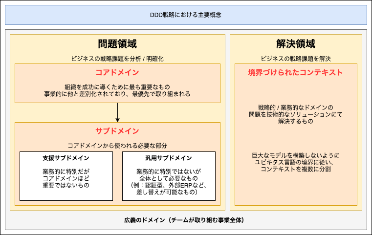

# 「ドメイン」と「境界づけられたコンテキスト」

## 「ドメイン」と「境界づけられたコンテキスト」の全体像

広義のドメインには「分析対象となる問題領域」と「事業課題の改善に取り組む解決領域」が含まれている。 
分析対象となる問題領域が「ドメイン」であり、その問題や課題の改善に取り組む解決領域が「境界づけられたコンテキスト」となる。

## ドメインとは

「ドメイン」とは、対象とする事業が取り扱う世界を表している。 
通常は「コアドメイン」と「サブドメイン」という適切な大きさに分割する。

### コアドメインとは

事業的に最も重要で戦略的に不可欠な部分。 
積極的に成長させてビジネス的な差別化を図る。 
DDDで開発を行う場合、十分に議論を行い、その部分が本当に「コアドメイン」かどうかを確認する必要がある。 
また、「コアドメイン」と定義した部分にビジネス的な強みがない場合は、DDDで開発を行うかを再検討する必要がある。

### サブドメインとは

「コアドメイン」ではない補助的な部分（システム的には必要でありつつもコアドメインではない部分）を「サブドメイン」と呼ぶ。 
「サブドメイン」は「コアドメイン」にとって必要な部分である。 
なお、当事者の視点によって「コアドメイン」と「サブドメイン」が入れ替わることに注意が必要。 
「サブドメイン」は「支援サブドメイン」と「汎用サブドメイン」の2種類に分類される。

#### 支援サブドメインとは

「コアドメイン」ほど重要ではないが、業務的に特別なものを表す。 
例えば、「コアドメイン」の支援を行う独自機能などが該当する。

#### 汎用サブドメイン

業務的に特別ではないが、そのシステムにおいて必要な箇所を表す。 
例えば認証機能やERPやECなど、極端な場合、交換されたとしても差し支えない機能が該当する。

## 境界づけられたコンテキストとは

ドメインの課題を解決する部分を「境界づけられたコンテキスト」と呼ぶ。 
1つの「コアドメイン（もしくはサブドメイン）」に、1つの「境界づけられたコンテキスト」が対応している状態が最適とされている。 
ただし、現実のシステムでは、複数の「ドメイン」に対して1つの「境界づけられたコンテキスト」しか存在しないケースも多々ある。

### 複数の意味を持つドメイン用語

システムにおける言葉は、業種によって意味が異なったり、状態の変化によって呼び方が変わる場合がある。 
DDDでは、1つの言葉が2つ以上の意味を保たないように「境界づけられたコンテキスト」を適切に分割し、プログラムの複雑化を防ぐ。

### ユビキタス言語を明確にする「境界づけられたコンテキスト」

DDDでは共通言語として「ユビキタス言語」を作り上げ、そのモデルに沿って実装する。 
そこで、ユビキタス言語の意味が変わる境界で「境界づけられたコンテキスト」を分割して管理する。

DDDの「コンテキスト」は「企業や組織の文化」に近い意味を持つ。 
つまり、「境界づけられたコンテキスト」はユビキタス言語が複数の意味を保たないようにするための明示的な境界と言える。 
この戦略的設計を適切に実行すると、異なる概念がドメインに混ざらないため、シンプルなシステムを構築できる。

### 「境界づけられたコンテキスト」と「ドメインモデル」の設計指針

「境界づけられたコンテキスト」の分割を行う際は、アーキテクチャ、タスク分担、成果物などの影響を受けないように注意する。 

## 分割した「ドメイン」と「境界づけられたコンテキスト」の評価方法

分割した「ドメイン」と「境界づけられたコンテキスト」が適切かどうかについて検証するにはいくつかの確認指針がある。

### ドメイン（問題領域）の評価ポイント

1. 戦略的コアドメインの名前、ビジョン、検討するべき概念が正しいか
2. 必要な支援サブドメインと汎用サブドメインの抜け漏れがないか
3. 各ドメインの担当者を招集可能か

### 境界づけられたコンテキスト（解決領域）の評価ポイント

1. 既存ソフトウェア資産の把握（再利用可否と相互接続状況の調査を含む）
2. 新規ソフトウェア資産の検討（開発可能かの調査も含む）
3. 既存ソフトウェアと新規ソフトウェアの統合方法検討
4. 依存する関連プロジェクトのリスク検討
5. ユビキタス言語の抜け漏れの確認
6. 境界づけられたコンテキスト間における「重複または共有してるユビキタス言語」の調査とマッピング方法 / 変換方法の検討
7. コアドメインの概念が境界づけられたコンテキストに適切に含まれているか確認
